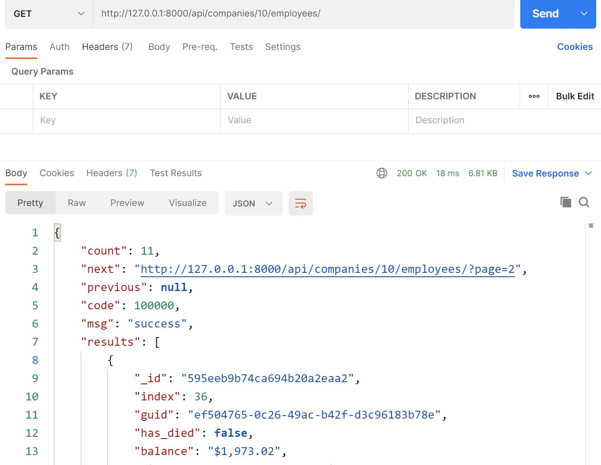
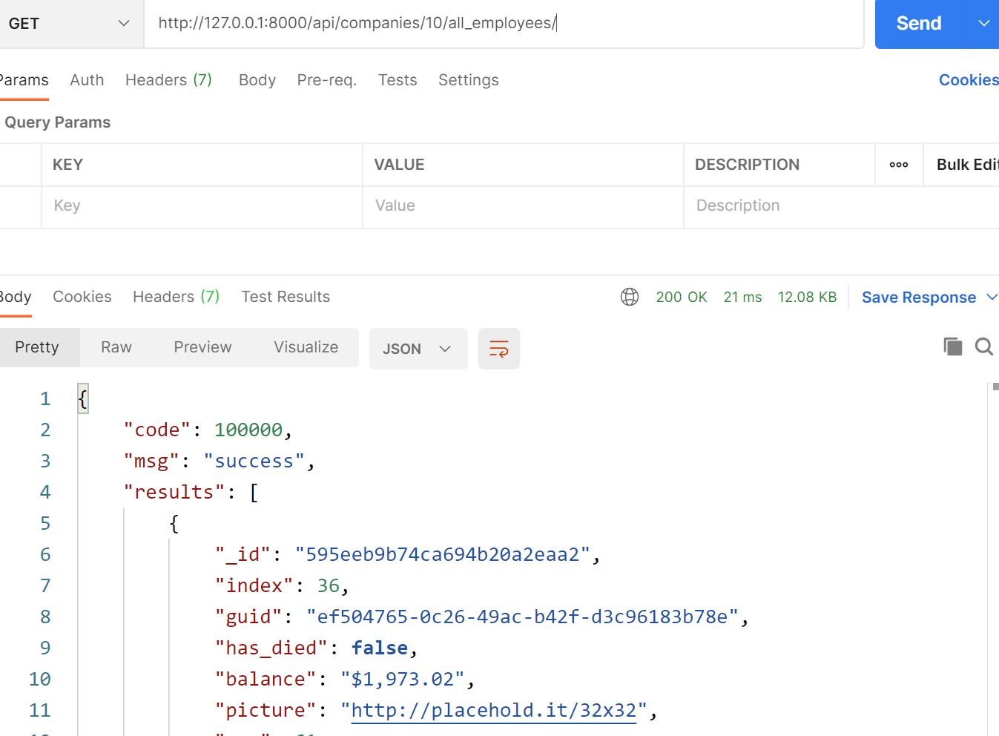
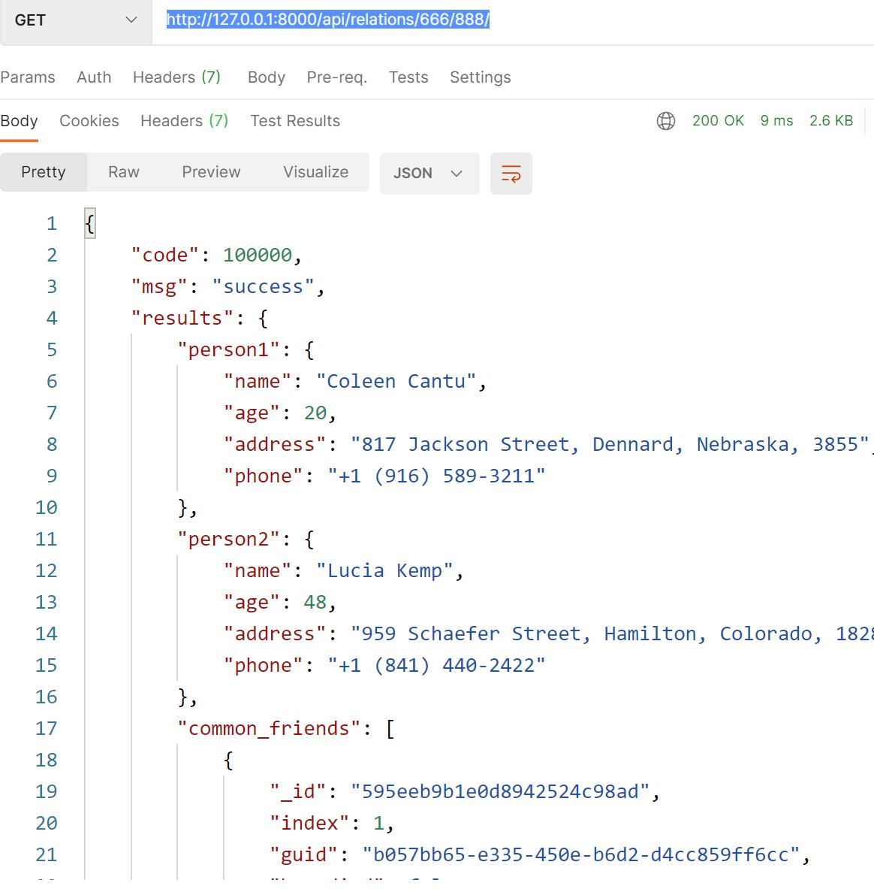
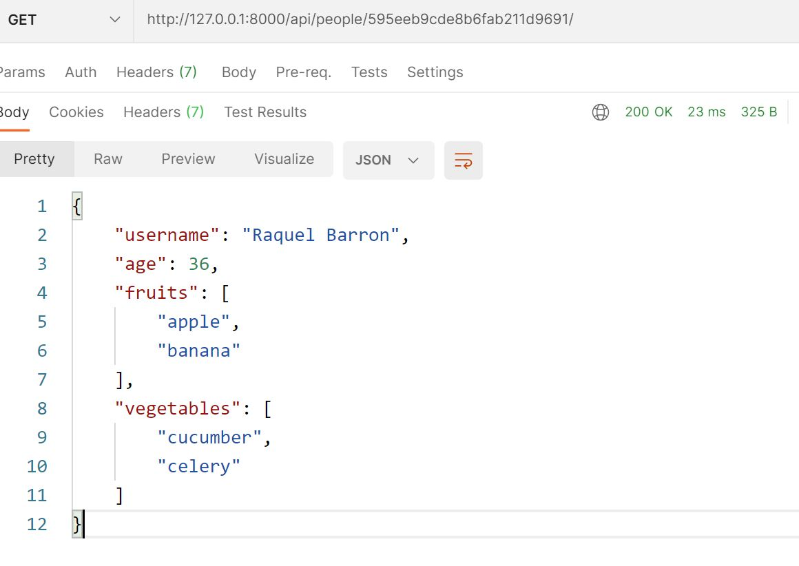

# Installation instructions

1. setup virtual env

   ```python
   pip3 install virtualenv
   mkvirtualenv pandora --python=python3.7
   ```

2. change to virtual pandora env

   ```python
   workon pandora
   pip3 install Django==2.2.20
   pip3 install djangorestframework==3.12.4
   pip3 install ujson==4.0.2
   ```

3. download this django project from github then run it in pandora virtual environment

   ```python
   python3 manage.py runserver
   # or give ip and port
   python3 manage.py runserver 0:8000
   ```

4. json files

   I put companies.json and people.json in 'pandora' folder. If user want to try different data, please keep the file path and file name the same as current.

   In previous email, Raghav told me that a food.json data file which has a 'type' attribute to map fruits & vegetables. As there are only two json files in resource folder, I defined my own food.json data file.

   ```javascript
   [
     {
       "type": "fruits",
       "names": [
         "strawberry",
         "banana",
         "orange",
         "apple"
       ]
     },
     {
       "type": "vegetables",
       "names": [
         "beetroot",
         "carrot",
         "celery",
         "cucumber"
       ]
     }
   ]
   ```


# Usage

1. Get a company's employees

   1.1 Response paginated data

   ​	API:	/api/companies/<company_id>/employees/

```bash
http://127.0.0.1:8000/api/companies/10/employees/
http://127.0.0.1:8000/api/companies/10/employees/?page=2&size=5
...
```



   1.2 Response all data

​		API:	/api/companies/<company_id>/all_employees/

This API is to give another option to fetch data. And user can try two functions at the same time.

```shell
http://127.0.0.1:8000/api/companies/10/all_employees/
```



2. Get 2 people's information and common friends

   API: /api/relations/<person1_id>/<person2_id>/

   ```bash
   http://127.0.0.1:8000/api/relations/666/888/
   ```

   

3. Get 1 person's information

   API: /api/people/<person_id>/

   The value of index filed are continuous number in people.json file. User can calculate them easily. So I choose "_id" field to get people' information.

   ```bash
   http://127.0.0.1:8000/api/people/595eeb9cde8b6fab211d9691/
   ```

   

4. By default, HTTP response will return a 204 status code when response data is empty. It can be changed to another value in each function.


   

# Testing

All these APIs are tested by Postman. The responses are correct.


# Enhancement

1. Make better performance

   Django includes a simplified development server for testing your code locally, but for anything even slightly production related, a more secure and powerful web server is required. It is recommended to use Nginx + uWSGI when deploy django project in production environment.

2. Use database

   There are only one thousand items in json files, so I stored all data in memory. We should use database (MySQL / PostgreSQL) when there is a large quantity of people number. We can discuss detailed information with DBA then setup some database. Build one or more database, set database routers for read and write respectively.

   We can use Redis server + cache_page (a django buildin caching framework) to cache the output of individual views, which will improve processing capacity of the web server.
